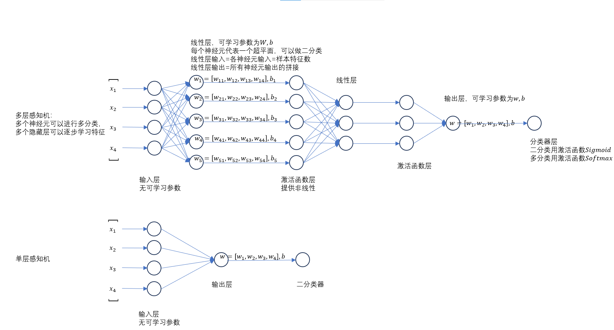
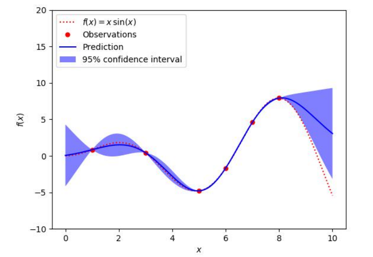

# 基础知识
- 标量$y$对向量$\mathbf x\in R^n$求导：一阶导是$[1, n]$向量（1个y分量对n个x分量），二阶导是$[n,n]$矩阵，三阶导是$[n, n, n]$ 张量
- e.g. $\partial_x \langle \mathbf w, \mathbf x \rangle = \partial_x \mathbf w^T \mathbf x = \mathbf w^T$（横向量）
- e.g. $\partial_x \langle \mathbf x, \mathbf x \rangle = \partial_x \mathbf x^T \mathbf x = 2x^T$（横向量）
- e.g. $\partial_w (\langle \mathbf x, \mathbf w\rangle - y)^2$
- 向量$\mathbf y\in n$对向量$\mathbf x\in m$求导：一阶导是$[n, m]$矩阵（n个y分量对m个x分量），二阶导是$[n, m, m]$张量（更复杂）
- e.g. $\partial_x \mathbf Ax = \mathbf A$(矩阵)
- e.g. $\partial_w \Vert \mathbf X \mathbf w - y\Vert^2$
- 注意：求导横向量-由外到内链式法则√
- 注意：求导列向量-由内到外链式法则
## 回归问题
输出某个样本的预测值。

### 数据（本质是样本+特征）
波士顿房价预测

### 线性回归模型（捕捉规律）
$$\hat y = w_1x_1 + ... + w_nx_n + b$$

### 平方误差损失函数（衡量）
$$l(y, \hat y) = \frac 1 2 (y-\hat y)^2$$
随着损失越小，收敛越慢。绝对值误差在最优点附近导数突变会导致不稳定。注意，损失函数的定义落到一个样本，而均方误差则是多个样本取平均，相当于还是落到一个样本。

### 优化器
1. 解析解
2. 小批量（不是1条）随机（随机采样）梯度下降（一阶）。考虑学习率、批量、平扫次数三个超参数

## 分类问题
输出某个样本的预测概率分布（概率分布即某个取值发生的可能性）

### 数据
Fashion-MNIST数据集

### 模型与softmax激活函数
$$softmax(o_k)=\frac{exp(o_k)}{\sum_i exp(o_i)}$$
$o_k$是网络初步输出。本质是满足每个类的概率非负且和为1。

### 交叉熵损失函数
$$H(\mathbf{p},\mathbf{q})=\sum_i -p_i \log(q_i)$$ 
本质上是一种散度，衡量两个分布的差异（分布即某种取值的概率）。用作分类问题的损失,即真实分布与预测分布的差异：
$$l(\mathbf{y,\hat{y}})=-\sum_i y_i\log \hat{y}_i=-\log \hat{y}_y$$
目标是真正正确的标签的预测概率值越大越好，最好是1

## 多层感知机

### 单层感知机模型
$$
o = \sigma(\langle \mathbf w, \mathbf x \rangle + b)
$$
其中
$$
\sigma(x) = 
\begin{cases}
1, & \textbf{if } x > 0; \\
0, & \textbf otherwise.
\end{cases}
$$
$\sigma(x)$是激活函数充当分类器，$\langle \mathbf w, \mathbf x\rangle + b$是超平面。只能用于XOR问题。

### 多层感知机模型
$$
h_1 = \sigma_1(\langle \mathbf W_1, \mathbf x \rangle + \mathbf b_1) \\
h_2 = \sigma_2(\langle \mathbf W_2, \mathbf x \rangle + \mathbf b_2) \\
o = \langle \mathbf W_3, \mathbf x \rangle + \mathbf b_3 \\
y = \sigma_3(o)
$$
其中
$\sigma_1(x), \sigma_2(x)$是激活函数在隐藏层提供非线性，常用的有$RELU, Tanh$:
$$
RELU(x) = \max(0, x)
$$
此外，$\sigma_3(x)$是激活函数在输出层充当分类器，常用的有$sigmoid$(二分类),$softmax$(多分类):
$$
Sigmoid(x) = \frac 1 {1+exp(-x)} \in [0,1]
$$

## 多层感知机的正则化技术
- 训练集：训练参数

- 验证集：根据结果调整超参数

- 测试集：不可知的，以后才知道

- 过拟合：模型容量远大于数据复杂度，模型把数据都记住了，连噪音都学到了，效果不好

- 欠拟合：模型容量远小于数据复杂度，能力不够

- K-则交叉验证：小容量数据集适用，一般的大数据集不用

- 解决模型过拟合问题这一行为叫做正则化
### 正则化技术1-权重衰退
$$
\min l(\mathbf w, b) \\
s.t. \Vert \mathbf w \Vert^2 \leq \theta
$$
刚性约束，用权重的均方范数衡量模型容量，用$\theta$控制模型容量的大小，$\theta$越小，防过拟合的效果越好

$$
\min l(\mathbf w, b) + \dfrac{\lambda}{2} \Vert \mathbf w \Vert^2
$$
柔性约束，$\dfrac{\lambda}{2} \Vert\mathbf w\Vert^2$作为正则项/惩罚项，$\lambda \rightarrow 0$ 代表对模型容量限制越多，防过拟合的效果越好

求导:
$$
\dfrac{\partial L}{\partial \mathbf w} = \dfrac{\partial l }{\partial \mathbf w} + \lambda \mathbf w
$$

更新:
$$
\mathbf w(t+1) = \mathbf w(t) - \eta \left(\dfrac{\partial l}{\partial w(t)} + \lambda \mathbf w(t) \right) \\
= \underbrace{(1 - \eta\lambda)}_{权重衰减}\mathbf w(t) - \eta \dfrac{\partial l}{\partial \mathbf w(t)}
$$
其中，$\lambda$是超参数

### 正则化技术2-丢弃法
$$
\begin{align}
   h &= \sigma_1 (\langle\mathbf{W_1}, x\rangle + \mathbf{b}) \\
   h &= dropout(h) \\
   o &= \langle \mathbf{W_2}, x \rangle + \mathbf{b} \\
   y &= \sigma_2(o)  
\end{align}
$$

Dropout 作用到某个隐藏层后，使得该层神经元输出按照概率随机置零，继续前向计算和将来的反向传播中求得的梯度相应位置都是0（未被置零的神经元输出由$h$变为$\dfrac{h}{1-p}$,从而保证下一层收到的输入的均值与未丢弃时的输入的均值保持一致），这样的操作降低了模型复杂度，从而防止在训练集上过拟合，提升模型的泛化能力。其中，$p$是超参数，常取$0.1, 0.5, 0.9$。
- 注意只在MLP使用，CNN用BN批归一化
- 注意只在隐藏层使用，输出层不能用
- 注意只在训练阶段使用，推理阶段开启model.eval()

## 多层感知机的数值稳定性技术
- 梯度爆炸:数值问题;学习率只在一个很小的区间
- 梯度消失:数值问题;不管学习率都会使得训练没有进展;底层网络训练不动
### 方法一：网络初始值
### 方法二：设置合理的激活函数(用Relu就好)

## CNN 模型

## RNN 模型

## Attention 模型

## 优化问题
给定损失函数，怎么优化是个问题。
凸优化问题保证局部解就是最优解
但是凸函数表达能力有限，现实中大部分问题都是非凸的，各种凸优化理论虽然可以揭示一些见解，但是对现实中的大部分优化问题指导意义并不大。

### 随机梯度下降
GD / SGD / mini-batch SGD

### 动量法
引入一个平滑窗口，用历史梯度来平滑当前梯度可能的波动，使得不那么跌宕，非常有趣。pytorch中的SGD优化器中就有momentum选项，一般选$0.5, 0.95, 0.99$。
$$
\begin{align}
      \mathbf v_t &= \beta \mathbf v_{t-1} + \mathbf g_t \\
      &= \mathbf g_t + \beta \mathbf  g_{t-1} + \beta^2 \mathbf g_{t-2} + \cdots \\
      \mathbf w_t &= \mathbf w_{t-1} - \eta \mathbf v_t
\end{align}
$$

### Adam
非常多的技巧，非常平滑，意味着对学习率超参数不敏感，如果没时间调优的话，Adam就是YYDS。超参数$\beta_1=0.9(平滑程度还好)，\beta_2=0.999(非常平滑)$.
$$
\begin{align}
      \mathbf v_t &= \beta_1 \mathbf v_{t-1} + (1 - \beta_1) \mathbf g_t \\
      &= (1 - \beta_1)(\mathbf g_t + \beta_1 \mathbf g_{t-1} + \beta_1^2 \mathbf g_{t-2} + \cdots)\\
      &发现系数和\sum_{i=0}^\infty \beta_1^i = \dfrac{1}{1-\beta_1}，权重和为1，可视为加权平均，更合理 \notag \\
      \mathbf{\hat v_t} &= \dfrac{\mathbf v_t}{1 - \beta_1^t} \\ 
      &因为i比较小的时候，\sum_{i=0}^t \beta_1^t = \dfrac{1-\beta_1^t}{1-\beta_1}，引入 \mathbf{\hat v_t}做修正 \notag \\
      \mathbf s_t &= \beta_2 \mathbf v_{t-1} + (1 - \beta_2) \mathbf g_t^2 \\
      \mathbf{\hat s_t} &= \dfrac{\mathbf s_t}{1 - \beta_2^t} \\
      & \mathbf s_t与\mathbf{\hat s_t}同理，引入是起类似归一化的作用 \notag \\
      \mathbf w_t &= \mathbf w_{t-1} - \eta \dfrac{\mathbf{\hat v_t}}{\sqrt{\mathbf{\hat s_t}} + \epsilon}
\end{align}
$$

**注意：**
- Adam非常平滑，对超参数不敏感，初期收敛速度特别快
- SGD+动量+学习率衰减：三个加起来可以打Adam，但学习率需要调，一旦小就需要好多轮才收敛

# 贝叶斯优化
黑盒函数（深度网络）的超参数优化：网格搜索，随机搜索，贝叶斯优化(100, 1000, 10000次)
## 条件概率
- $Pr(B|A) * Pr(A) = Pr(A, B)$:左移法则，不是凭空消失，而是并列；此外，条件是要考虑的空间
- $Pr(C|B,A) * Pr(B|A) = Pr(C,B|A)$:左移法则
- 贝叶斯法则：$Pr(A_1|B_1) = \dfrac{Pr(A_1) * Pr(B_1|A_1)}{Pr(B_1|A_1)+Pr(B_1|A_2)}$。
  - $Pr(A_1)$是先验，即没有任何实验的前提下推测的概率
  - $Pr(B_1|A_1)$ 是似然
  - $P(B)=Pr(B_1|A_1)+Pr(B_1|A_2)$是证据
  - $Pr(A_1|B_1)$是后验，即有实验支撑条件下在先验基础上修正得到的概率。经典例子是A盒B盒，黑球白球

## 正态分布
### 一维正态分布
给定随机变量 $X = [x_1, x_2, \cdots, x_n] \in R^1$，且假设服从正态分布，则有
$$ 
X \sim N(\mu, \sigma) 
$$
$$
\mu = \dfrac{1}{n} \sum_{k=1}^n x_k
$$
$$
\sigma = \dfrac{1}{n} \sum_{k=1}^{n}(x_k - \mu)
$$

### 二维正态分布
给定随机变量$\mathbf X = [\mathbf{x}_1, \mathbf{x}_2, \cdots, \mathbf{x}_n] \in R^d$. 且假设服从正态分布，则有
$$
X \sim N(\mathbf{\mu}, \mathbf{\Sigma})
$$
$$
\mathbf \mu = \dfrac{1}{n} \sum_{k=1}^n \mathbf{x}_k \in R^d
$$
$$
\Sigma = [cov(i,j)] \in R^{d \times d}, i, j \in [d]
$$
$$
cov(i,j) = \dfrac{1}{n}\sum_{k=1}^n (x_k^i - \mu^i)(x_k^j - \mu^j)
$$
拓展到高维后，方差拓展到协方差矩阵，$cov(i,j)$是样本上两个属性值距离各自对应平均值的距离的乘积的平均，用来衡量两个属性的相关性。批量计算时构建一个样本集，每行代表样本，每列代表属性：
- 首先求出一行平均值，样本集的每一条样本都减去平均值
- 样本集转置并右乘样本集，左一行（代表所有样本的第i个属性，即$x_k^i-\mu^i$）右一列（所有样本的第j个属性，即$x_k^j-\mu^j$）对乘加得到$\sum_{k=1}^n(x_k^i-\mu^i)(x_k^j-\mu^j)$
- 最后除以$n$

## 高斯过程
黑箱函数表达式未知或形式过于复杂，想为训练找到一个最优超参数（比如学习率）代价极大。
贝叶斯优化提出用高斯过程近似拟合该黑箱函数$f$，与其他方法最大的不同给定输入$x$, $f(x)$是一个确定值，而高斯过程输出一个值的概率分布。

拟合的步骤是
- 在预测前就知道，单点的分布为
   $$
   f(x) \sim N(\mu(x), \sigma^2(x))
   $$ 
   $\mu(x)$是$f(x)$概率分布的均值，是$f(x)$最有可能取到的值，与$x$有关，$\mu(x)=0$作为均值的先验知识

   $\sigma^2(x)$是$f(x)$概率分布的方差，表征$f(x)$取值的不确定性。由于高斯过程中某一点的协方差/不确定性取决于与那些已知训练点间的距离/相似度，即离已知的几个训练点越近，不确定性越小。因而**在高斯过程中协方差由核函数定义**，这种函数能够衡量任意两个样本点的距离/相似度，常见的有平方指数核函数(径向基核函数)
   $$\Sigma(x,x^{'}) = k(x, x^{'}) = \sigma_f^2 \exp(-\dfrac{\Vert x - x^{'}\Vert^2}{2l^2})$$
   其中$\sigma_f^2$是幅度系数。所以单点分布改为
   $$
      f(x) \sim N(\mu(x), \Sigma(x,x))
   $$
   $\Sigma(x,x) = \sigma_f^2$ 作为协方差的先验知识

   - **特别注意**：普通的多维高斯分布，属性维度的提升会导致方差变为协方差矩阵，本质是用来揭示不同属性之间的相关性。而高斯过程中多维属性并不会导致方差变为协方差，核函数会一视同仁处理成标量。高斯过程中的协方差是用来揭示不同样本呢之间的相似性的，协方差矩阵的大小与样本量有关。
   
 - 假设从黑盒函数中获得了$n$个训练点 $x_{1:n} = \left[\{x_1, y_1\}, \{x_2, y_2\}, \cdots, \{x_n, y_n\}\right]$, 每个训练点都服从正态分布，则这些样本总体服从联合正态分布
   $$
   f(x_{1:n}) \sim N(\mu(x_{1:n}), \Sigma(x_{1:n}))
   $$
   $$
   \mu_{1:n} = [\mu(x_1), \mu(x_2), \cdots, \mu(x_n)]
   $$
   $$
   \Sigma_{1:n} =
   \begin{bmatrix}
       \Sigma(x_1,x_1) & \Sigma(x_1,x_2) & \cdots & \Sigma(x_1, x_n) \\
      \Sigma(x_2, x_1) & \Sigma(x_2,x_2) & \cdots & \Sigma(x_2,x_n) \\
      \cdots & \cdots & \cdots & \cdots \\
      \Sigma(x_n, x_1) & \Sigma(x_n,x_2) & \cdots & \Sigma(x_n,x_n) 
   \end{bmatrix}
   $$
- 基于所有训练点，对于取任意一个测试点$x=x^*$，$f(x)$，他所服从的正态分布为
   $$
   f(x) | f(x_{1:n}) \sim N(\mu(x), \sigma^2(x^*))
   $$
  $\mu(x^*)$的计算公式为
  $$
   \mu(x^*) = \underbrace{\mu(x^*)}_{先验信念，没有任何样本的情况下的值} + \underbrace{\Sigma(x^*, x_{1:n})^T \left(\Sigma(x_{1:n}, x_{1:n})^{-1} + \sigma_n^2I \right) (f(x_{1:n})-\mu_{1:n})}_{\substack{基于证据的更新 \\ 相比于\sigma^2(x^*),最后一项改为y，也就是所有样本的标签向量}}
  $$
  $\sigma^2(x^*)$的计算公式为
  $$
   \sigma^2(x^*) = \underbrace{\Sigma(x^*, x^*)}_{\substack{先验信念=\sigma_f^2 也就是没有任何样本 \\ 的情况下根据核函数得到的与自身的相似度 }} - \underbrace{\Sigma(x^*, x_{1:n})^T \left(\Sigma(x_{1:n}, x_{1:n})^{-1} + \sigma_n^2I\right) \Sigma(x^*, x_{1:n})}_{\substack{基于证据的更新 \\ 中间是已有样本点彼此的相似度矩阵，即协方差矩阵\in R^{n \times n} \\ 两侧是预测点x^*与所有样本点的相似度向量，即协方差向量\in R^{1 \times n}}}
  $$
  其中$\sigma_n^2 \in [1e-10, 1e-5]$是样本噪音方差，噪音越大，拟合的函数越光滑，反之越细腻。
  - **特别注意**：区分$\sigma^2(x^*), \sigma^2(x_{1:n})$与$\sigma_f^2, \sigma_n^2$
  - **Insight**：取样越接近训练点，第二项越大，$\sigma^2(x^*)$越小，不确定性越小。当预测点从训练点中选时，$\sigma^2(x^*)=0$，不确定性为0，高斯过程在这一点上完全拟合黑箱函数
  
   这是一个后验概率，就是在先验概率的基础上根据证据做修正。比如选A盒的概率vs拿到黑球的条件下选A盒的概率。比如这里$f(x)$的概率vs在已知多个训练点的条件下$f(x)$的概率。

## 采集函数
采集函数本质就是一个打分函数。输入$f$的后验概率分布$f(x)|f(x_{1:n})$，以及之前的训练点$x_{1:n}$中对应最大的函数值$f(x^+)$，输出对非训练集的任意一个点$x$的打分，打分的标准是$x$点对应的$f(x)$所服从的概率分布，其均值$\mu(x)$应该要比$f(x^+)$改进得尽可能多，而且不确定性要尽可能小。最后选打分最高的一个进入到训练集，帮助调整$f(x)$的后验分布

### 期望改进采集函数EI
评分标准为
$$
\begin{align}
   EI(x) & = E[\max(0, f(x)-f(x^+))] \\
         & = \int_{f(x^+)}^{f(x)} (f(x) - f(x^+)) \times p(f(x)) \mathrm{d} f(x) \\
         & = \underbrace{(\mu(x) - f(x^+))\Phi(Z)}_{\mu(x)比f(x^+)高出越多越好} + \underbrace{\sigma(x)\phi(Z)}_{不确定性越小越好} \\
\end{align}
$$
其中
$$
Z = \dfrac{\mu(x) - f(x^+)}{\sigma(x)} 是标准化变量 \\
\Phi 是标准正态分布的CDF \\
\phi 是标准正态分布的PDF
$$

EI是打分函数，我们选择得分最高的点，即
$$
   x_{n+1} = \argmax_x EI(x)
$$
至于如何找到得分最高的点，这是另外一个优化问题了

# 启发式算法优化
遗传算法
粒子群算法

## 统计学
### 根据分布采样本
### 根据样本推分布
   - 点估计
     - 矩估计
     - 最大似然估计
   - 区间估计

